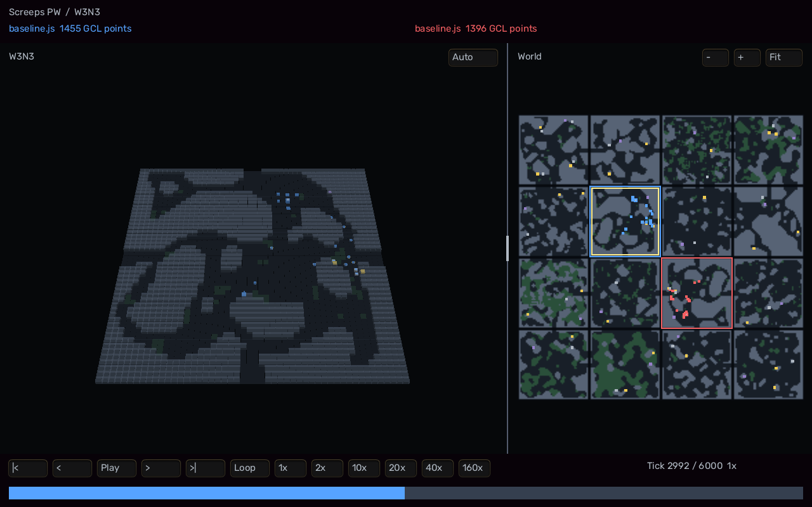

# Screeps PW

Screeps World as a finite Coworld league, with native JavaScript policies and
recorded-state 3D Polyworld replays.

The game is running on Softmax. [Join the Competition league](https://softmax.com/observatory/v2?detail=league:league_ac545b38-4caa-4873-a202-769697261f26)
or start with the [colony example](players/colony/main.nim).
This repository contains the complete game adapter, example bot source, World
bindings, 3D replay viewer, tests, and Coworld packaging. The official open-source
[Screeps server](https://github.com/screeps/screeps) supplies the simulation.



## Start with the example bot

Clone the repo and compile the colony bot with Nim 2+; this step needs neither
Docker nor the viewer dependencies:

```sh
git clone https://github.com/monofuel/screeps_pw.git
cd screeps_pw
nim js players/colony/main.nim
```

The output is `build/players/baseline.js`, ready to submit. The bot harvests,
spawns workers, builds infrastructure, upgrades controllers, scouts, and runs
remote operations. Change [worldStrategy.nim](players/colony/worldStrategy.nim)
or the shared behaviors in [botlib](players/colony/botlib), then compile again.
The required Nim World bindings are included in `players/colony/bindings`.
There is also an [idle control](players/idle.nim) for integration checks.

For a quick trial, [download the compiled baseline from the running league](https://softmax.com/api/observatory/v2/coworlds/cow_dede9385-2a54-495b-95ab-208c59a032e2/player-files/3b53a1030e53edf2a1098628cc0c5e735c13e5974474d798b2f430921432ee4e)
and save it as `baseline.js`. Use that filename in the upload command below.

You can instead bring any existing Screeps World bot that bundles into one
CommonJS file. See the [official Screeps API](https://docs.screeps.com/api/).

## Game rules

| Rule | Competition |
| --- | --- |
| World | Fixed 4×4 private World: 16 rooms, W1–W4 / N1–N4, sealed outer exits |
| Players | Two independent accounts; starter bots and their colonies removed |
| Starts | Center cells (1,1) and (2,2), indexed from the viewer's top-left: seat 0 W3N3 (32,9), seat 1 W2N2 (17,40) |
| Assets | One spawn containing 300 energy, RCL1, GCL1, empty Memory |
| Account CPU | 20 CPU; empty initial bucket; native replenishment and execution/memory guards |
| Duration | Exactly 1,500 completed ticks |
| Score | Closing cumulative account GCL points minus opening points |
| Winner | Higher earned GCL wins; equal scores draw |
| Colony loss | Previously earned points remain; the match continues |
| Script errors | Native runtime behavior; private diagnostics; the match continues |
| Gameplay | Native visibility, API, intents, economy and combat |
| NPCs | Optional NPC spawning jobs disabled for this fixture |

The starting rooms match under a 180° rotation; the surrounding map is asymmetric.
League duels evaluate both starting assignments. Each
episode retains its own scores; there is no survival bonus, elimination win, or
research-benchmark qualification gate. GCL points are cumulative account points,
not integer GCL levels, controller levels, or current-level progress.
W2N2 supplies the two-source home-room template. W3N3 copies its terrain,
sources, controller and mineral under `(x,y) -> (49-x,49-y)`, with matching
resource quantities and regeneration state. Spawn placement rotates too.
Both homes have four-tile entrances at border coordinates 23–26; adjoining
neighbor entrances are aligned and connected. Other rooms retain their native
resources and terrain apart from exit corridors. Every adjacent pair connects,
and the outer border is sealed. The starts are two room transitions apart.
Native terrain and accessible-room caches are rebuilt before play.
The seed is recorded as fixture metadata; the map is fixed and
does not reseed native JavaScript randomness.

## Simulation and playback clocks

The engine advances immediately after a committed turn, without inter-tick
sleep or an internal whole-match wall-clock cutoff. Actual throughput depends
on scripts, engine work, and I/O. Script CPU and memory guards remain enabled.

Completed replays default to **10x playback: 10 ticks per second**. A full
competition replay takes two and a half minutes. Normal 1x playback is one tick per second.
Playback speed does not affect simulation or scores.

Hosted episodes have the platform's required watchdog, declared as 100 minutes.
A killed or incomplete episode does not produce a completed game result.

## Submit a policy

Supply a self-contained JavaScript file exporting `loop`, at most
**5 MiB (5,242,880 bytes)**, or a **ZIP32 package** with `main.js` at its root.
ZIPs may contain up to **256 flat files**, **16 MiB (16,777,216 bytes) total
unpacked contents**, and **17 MiB (17,825,792 bytes) of archive bytes**.
All limits are inclusive and shared by local and hosted runners. Empty uploads
are rejected. Packages are recognized by content, independently of filename.

```javascript
module.exports.loop = function () {
  // Ordinary Screeps World account code.
};
```

Participants may author JavaScript. Project tooling, fixtures, and our reference
bots are authored in Nim; generated JavaScript stays outside Git.

The official runner provides `Game`, `Memory`, `RawMemory`, and intent
processing. Submitted code is account code, not a server mod, npm package, or
native process. It runs in the official per-account sandbox. Private logs are
bounded to 10 MiB per seat and never included in the public replay.

ZIP JavaScript files become text modules; every other file becomes a binary
module. Module names omit the final extension: `helper.js` is `require('helper')`,
`brain.wasm` is `require('brain')`, and `weights.bin` is `require('weights')`.
Binary modules return an ArrayBuffer; instantiate WASM with `WebAssembly.Module`
and `WebAssembly.Instance`, or read data with a typed array. JSON files are
binary resources too; parse their decoded text in your bot if needed.

Use flat ASCII filenames containing letters, numbers, dots, underscores or
hyphens, at most 255 bytes. Leading dots and repeated dots are rejected.
Stored and Deflate ZIP compression are supported, including data descriptors.
Nested paths, duplicate filenames or module names, symlinks, directories,
encryption, multi-volume archives and ZIP64 are rejected. Names `__proto__`,
`prototype`, `constructor` and `lodash` are reserved. Archive contents are
validated and decompressed with bounded output before account code executes.
Dependencies must be bundled into these modules; npm installation, host file
access and external ML runtimes are not provided. WASM inference uses the
existing account CPU and memory budgets.

The [WASM example](players/wasm/main.nim) is a small independent bot combining
integer addition in WASM, another JavaScript module and binary bytes to spawn
`Zip13`. Build it without Docker:

```sh
make wasm-example
uv tool run --from 'coworld[auth]==0.1.56' coworld upload-policy --file build/players/wasm.zip
```

The SDK also packages directories passed to `--file`; supply a directory with
the same flat layout. For local matches use `build/players/wasm.zip` as either
policy argument. The hosted package bundles the frozen public colony snapshot
and WASM example; the idle control remains available in this repository for
local checks. The colony snapshot is not synchronized with newer private bot
work. Human gameplay controls remain outside this MVP.

Install [uv](https://docs.astral.sh/uv/getting-started/installation/), sign into
your own Softmax account, upload a policy, and submit the returned version:

```sh
uv tool run --from 'coworld[auth]==0.1.56' softmax login
uv tool run --from 'coworld[auth]==0.1.56' coworld upload-policy --file build/players/baseline.js
uv tool run --from 'coworld[auth]==0.1.56' coworld submit YOUR_POLICY_REF --league league_ac545b38-4caa-4873-a202-769697261f26 --no-open-browser
```

Replace `YOUR_POLICY_REF` with the exact `name:vN` printed by `upload-policy`.
You do not need Docker, Nim, or a game build to upload an existing JavaScript
bot. Watch completed matches from the league's episode pages.

Policy versions belong to the uploading player. For another owned player,
`nim r tools/playerUpload.nim PLAYER_ID POLICY_FILE POLICY_NAME` uses a private
temporary credential directory and leaves the shared active player unchanged.
Submit that version with `--player PLAYER_ID`, or use the Observatory. Each user
may field two players.

## Build and run locally

Use Linux, Docker, Nim 2+, Nimby 0.2.3+, Make, and sha256sum. The browser build
uses the pinned Nix toolchain when Emscripten is absent.

```sh
make deps
make engine
make build
build/match build/players/baseline.js build/players/idle.js
build/match build/players/idle.js build/players/baseline.js
make test
make integration
make viewer
make browser-test REPLAY=/absolute/path/to/match.replay
```

The runner accepts `--ticks:NUMBER`, `--seed:NUMBER`, `--output:DIRECTORY`,
and `--image:IMAGE`. Short horizons are for smoke checks; competition uses
1,500 ticks. Artifacts default to `~/.local/share/screeps-pw/matches/`.
Set `PW_TIMING=1` to write per-process stage and storage-call timing to
`internal/timing-*.json` in the match directory; it adds measurable overhead.

`make engine` pulls the immutable public runtime from the published 0.1.2
Coworld package. Its upstream Screeps revision is
`7ff972231c0a0a7aa91978297432ddb806976281`, with engine 4.3.0, driver 5.3.0,
and Node 22.23.2. No private repositories or registry login are required.
Matches use disposable storage, no network, and no staging volume or game/admin
ports. Cancellation cleans up the episode container.

`make upload-integration` builds the package and checks actual game-hosted
staging at JavaScript and ZIP size boundaries, WASM execution in both seats,
and failed-seat attribution for invalid packages. These checks use disposable
local episodes.

`make deps` creates a separate Nimby workspace under
`~/.local/share/screeps-pw/deps/`. It does not move shared workspace checkouts.
`SCREEPS_PW_DEPS` overrides that location. The small Node bridge, JSON decoder,
and turn scheduler are included in `runtime/shared`. All required bot source
is included; the build does not read sibling repositories.

## 3D viewer

The Nim/WASM viewer uses Polyworld's RTS camera and shared HUD theme. Terrain
walls rise above a room board; buildings and creeps use procedural geometry and
ownership/body-part colors. Click objects for
inspection. The viewer starts with a 50/50 split: the selected 3D room on the
left and a detailed world map on the right. Drag the divider to resize the panes.
The map shows every room's walls, swamps and open ground, with ownership borders
and recorded creep, resource and building markers. Click a room to select it in
3D; its gold outline follows the selection. Drag or middle-drag the map to pan,
use its wheel or +/- buttons to zoom, and press Fit to restore the full world.

In the 3D pane, pan with arrow keys or the middle mouse button and zoom with
the wheel. Arrow keys over the map pan that view instead. The full-width bottom
bar controls play, pause, stepping, seeking, looping and speed.

Auto starts in the first player's recorded starting room. It holds each room
for at least 30 seconds of visible, playing time, then cuts instantly to a
whole-room view. Recent combat takes priority over controller upgrades, ownership
changes and building completion or destruction. During quiet play it tours
rooms with player creeps or active spawning, choosing the least recently shown
room. Events stay relevant for 10 seconds of viewing time; idle buildings alone
do not attract the camera. Playback speed does not shorten these holds.

Clicking a room or the 3D scene, inspecting an object, or panning or zooming the
3D camera switches to Manual. Press Manual beside the room heading to resume
Auto from the current room with a fresh 30-second hold. Map pan/zoom and divider
resizing preserve the mode. Pause and hidden tabs freeze Auto; seeking and replay
loops clear recent events and restart the hold without changing rooms.

The replay records the shared authoritative world once, including tick 0 and
every completed tick. Static terrain is stored once. Independently compressed
100-tick chunks begin with full keyframes and continue with entity upserts and
removals. The decoder reconstructs recorded state without running a Screeps
server or resimulating intents. Policy source, Memory, tokens and console
messages are excluded from replay entity data.

The static bundle reads the replay URL from `#replay=`, with query fallback,
and reports readiness after displaying a valid frame. Browser viewing requires
serving the bundle over HTTP. There is no live 3D viewer in v1.

`make browser-test` starts disposable headless Chromium and a loopback HTTP
server on ports 8770 and 8769, checks the supplied replay, then stops both.
It verifies visible geometry, normal/default playback clocks, pause, stepping,
timeline seeking, terrain detail, linked room selection, map pan/zoom and input
isolation, divider resizing, window resizing, and visible missing-replay errors.
Screenshots and browser profiles stay under `~/.local/share/screeps-pw/`.

For real-time Auto hold, tour and manual takeover checks, use
`make director-browser-test REPLAY=PATH` with a full 6,000-tick 4×4 replay
containing two active colonies. This takes about two minutes.

The league's episode page opens the hosted 3D viewer. The CLI can print its
viewer link without launching a desktop browser:

```sh
nim r tools/sdk.nim replay-open EPISODE_REQUEST_ID --hosted --no-open-browser
```

Set `SCREEPS_PW_VIEWER_URL` when running `make browser-test` to check a hosted
viewer session instead of the local bundle. Both full competition replays and
short certification replays are supported.
Previous episodes retain their immutable viewer version; new episodes use the
current canonical game package.

## Coworld package

```sh
make package
make certify
```

Set `VERSION` for later immutable releases, for example
`make package VERSION=0.1.6`.

Run `make deps` and `make engine` first. Packaging rebuilds the adapter on top
of the pinned public engine runtime. Building and certifying locally do not
publish a release or change the running league.

For a viewer-only package, pass `GAME_IMAGE` to reuse an existing game image.
For example, the viewer-only 0.1.4 release used
`make package VERSION=0.1.4 GAME_IMAGE=screeps-pw:0.1.3`.
The ZIP module loader in 0.1.6 requires a rebuilt game image; package it with
`make package VERSION=0.1.6` without `GAME_IMAGE`.

Packaging uses public `coworld[auth]==0.1.56` through an isolated uv environment.
`nim r tools/sdk.nim ...` wraps the same CLI. Maintainers may explicitly set
`COWORLD_SOURCE` to the original tested source checkout at
`d9d2a9a91131e7ef2f7c9ef6ac35c53775a5a386`; its adjacent `softmax-cli` package
must also be present. This override is optional.

The game image owns both policy VMs and all engine processes. No nested Docker
or separate player pods are required. The package declares the
`coworld-player-seats/2` file-player contract, a 1,500-tick competition variant,
a 600-tick certification fixture, private seat logs/status, a health endpoint,
global WebSocket Ping/Pong, and a static replay bundle.

The public runtime retains the frozen official Node binary, engine installation,
shared libraries and license documentation. It is about 487 MB.

Replay and private outputs finish before the atomic results completion marker.
The lifecycle server stays available until the platform stops it. The generated
SDK viewer hook is a Nim executable at the required
`tools/build_replay_viewer.sh` path; no authored shell script is used.

The initial league configuration is one Competition division, paired duels,
Elo 1500/K32 without margin weighting, and a thirty-minute round cadence.
Rounds wait for two eligible entrants. The published Coworld name is the literal
`Screeps PW`, including spaces and capitalization.

## Verification evidence

The original 121-room map's evidence below is historical; it does not describe
the smaller 4×4 fixture. Current map checks and match evidence are recorded in
[the verification record](coworld/VERIFICATION.md).

Two full 6,000-tick baseline-versus-idle matches completed on the initial build:

| Baseline start | Earned GCL | Idle GCL | Engine wall time |
| --- | ---: | ---: | ---: |
| W1N1 | 32,416 | 0 | 165 seconds |
| W9N9 | 16,792 | 0 | 168 seconds |

These are integration controls, not hosted standings or claims of deterministic
timing. Exact policy/adapter/image hashes and fixtures are retained with each
match. Preserve both starting assignments when comparing policies.

The final runtime repeated the W1N1 control with exactly 32,416 earned points
over 6,000 ticks. Integration checks also cover exact starting assets, chunk
boundaries and backwards seeks, private script errors, infinite-loop and heap
guards, denied host modules/process access, cancellation cleanup, and engine
failure without completed results. The 600-tick Coworld fixture scored 290:0.
See [the verification record](coworld/VERIFICATION.md) for frozen hashes,
commands, and compact artifact references.

The first hosted Competition round completed both 6,000-tick starting
assignments, scoring the same 32,416:0 and 16,792:0 as the local controls.
Softmax published colony MMR 1516 and idle MMR 1484. The hosted replay also
passes the full browser checks. These two starter policies establish operation;
they do not measure strength against independent submissions.

## References and ownership

Mindustry's Coworld wrapper is the reference for original-engine lifecycle,
shared-world replay chunks, and output finalization. Its BASIC policy interface
and game rules are not used here.

Polyworld supplies camera and graphical UI modules. Screeps owns simulation.
[Heartleaf](https://github.com/Metta-AI/coworld-heartleaf) is a reference for
hosting the game and its example players together. The colony example, World
bindings and small runtime helpers are snapshots from the author's Screeps
workspace; their provenance is recorded in [THIRD_PARTY.md](THIRD_PARTY.md).

Project code is licensed under [MIT](LICENSE); upstream code and assets retain
their original notices.

See [THIRD_PARTY.md](THIRD_PARTY.md) for pinned code/assets and license notices.
Persistent worlds, configurable or fully symmetric maps, additional players, richer models,
live visualization, and additional submission formats are later work.
