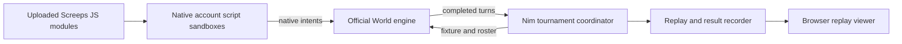

# Screeps PW

Make Screeps a Polyworld/Coworld-shaped game that we can submit to Softmax as a
league: uploaded policies, bounded matches, explicit results, private policy
logs, and browser replays.

**Status: planning only.** There is no implementation, runnable package, hosted
release, or league yet. This document separates inspected references from
working proposals. Implementation starts when requested.

## Direction

**Decision: keep Screeps' native JavaScript policy system.** Participants upload
ordinary Screeps modules exporting `loop`, with native `Game`, `Memory`, and
intent semantics. Do not introduce Bassy or translate the API into BASIC.
Our own bots and integration tooling remain authored in Nim.

**Decision: run unpaced matches until the declared game ending condition or
completed-tick horizon.** No inter-tick sleep and no fixed whole-match
wall-clock timeout. Advance as soon as the previous turn has finished; actual
CPU utilization and throughput depend on the engine, scripts, and I/O.
Per-script CPU/memory rules are separate from match pacing.

**Decision: v1 is a two-player Screeps World GCL race on the default small
private-world map, lasting 36,000 completed ticks.** Highest earned account GCL
points wins; equal scores draw. Start by adapting the existing isolated runner.
Polyworld/Coworld supplies the eventual league packaging and replay model;
adopting it does not require its policy language or renderer.

The first pushable MVP is a local runner: load two `main.js` files, create their
accounts in a disposable world, run the match, and write `results.json` with
scores and runtime errors. Browser replay viewing and hosted league packaging
are later milestones, not requirements for this first implementation.

## What the references establish

| Reference | What is useful here | What still needs work |
| --- | --- | --- |
| `coworld-mindustry` | Original-engine integration; independent survival and shared 4v4 modes; game-hosted files, private logs, replay package | Reuse packaging/lifecycle ideas while retaining Screeps' own script runtime |
| Polyworld | Coworld lifecycle, manifest, output finalization, and replay integration | Choose a pinned reuse boundary; its BASIC host is outside this design |
| `screeps_autoresearch` | Pinned official World image; disposable worlds; native JS policies; Nim-generated Node glue; unpaced completed turns and GCL measurements | Multi-account tournament rules/results and replay capture; current cases are bot benchmarks |
| `screeps_lib` | Nim World/Arena API bindings and JS compilation conventions | Bind any missing API needed by reference bots or trusted engine glue |
| `screeps_bot` | Colony behavior and shared movement, spawning, economy, defense, scouting, and expansion utilities | Compile reference entrants using the same native policy interface |

Mindustry's standalone README still introduces survival, while its guide and
host also implement shared team PvP. For this design, use the guide, manifest,
and source together. Its six-tick policy cadence, full-map PvP visibility, team
layout, scores, and Java determinism patch are game-specific choices.

The relevant Screeps mechanics are already tick-based: actions create intents
that the engine resolves after player code runs. Its standalone server contains
multiple cooperating processes. We can retain that loop instead of building
a new policy bridge.
See the [official server](https://github.com/screeps/screeps) and
[game-loop documentation](https://docs.screeps.com/game-loop.html).

## Proposed runtime

This is the target integration. The first MVP writes results and diagnostics;
the replay recorder and browser viewer follow later.

The coordinator and engine hooks are authored in Nim; Node-facing hooks compile
with Nim's JS backend. Submitted policies execute through the official runner,
never by importing them into the coordinator's ordinary Node environment.
Screeps owns account observations, visibility, script execution, memory, API
return codes, and intent validation/resolution. The tournament layer owns
initial state, seat/account mapping, turn horizon, ending rules, and artifacts.

For each turn, let the official runner finish account scripts, let the engine
process their intents and commit state, then inspect that completed state for
recording and terminal conditions. Queue the next turn immediately when the
match continues. Preserve the engine's conflict rules and account isolation.

## Existing speed and sandbox mechanisms

These are inspected source facts, not new implementation:

- `../screeps_autoresearch/runtime/turnScheduler.nim` replaces the official
  coordinator's between-turn `setTimeout(loop, ...)` with `setImmediate` after
  `mainLoopStage=finish`. Unrelated timers remain intact. This removes timed
  pacing while yielding for worker and I/O progress.
- `runtime/control.nim` awaits committed-turn checks through
  `mainLoopCustomStage`, records progress, and stops the engine at the declared
  terminal boundary. Preserve that ordering for tournament results and replays.
- `src/benchmarkRunner.nim` runs a fresh container with `--network none`, a
  disposable `/world` tmpfs, host-UID execution, read-only input files, and an
  episode-only output mount. It does not mount the staging world or Docker socket.
- The benchmark runner currently requires a positive wall-clock timeout and
  kills the container if it expires. That is distinct from the unpaced scheduler;
  the tournament design removes this fixed whole-match cutoff. Existing
  benchmark behavior is unchanged.
- Benchmark fixtures currently grant the candidate account 20 Screeps CPU.
  Removing inter-tick pacing does not remove that script budget.

Upstream Screeps uses a per-account `isolated-vm` runtime, with heap and script
execution limits. This is the existing script sandbox to retain, alongside
disposable match containers. See the official
[VM implementation](https://github.com/screeps/driver/blob/master/lib/runtime/user-vm.js)
and [execution path](https://github.com/screeps/driver/blob/master/lib/runtime/make.js).
Verify the exact pinned driver during implementation; these upstream references
are not an audit of our built image or proof of public-policy containment.

Keep three controls distinct:

| Control | Tournament direction |
| --- | --- |
| Inter-tick pacing | None; continue after the previous turn commits |
| Whole-match wall-clock cutoff | None; finish by game rules or completed-tick horizon |
| Per-account CPU/bucket, memory, and script execution guards | Separate league decision; retain native guards unless explicitly changed |

An unbounded script that never returns prevents a turn from completing, so
removing every execution guard would require a separate decision. Full-speed
simulation does not require that change. Cancellation and engine failure still
need cleanup; neither creates a normal completed match result.

## Submission interface

Use one self-contained `main.js` exporting `loop` per player for the MVP,
matching the current benchmark input and our Nim-compiled World bot. Support
multi-module bundles later if needed, with defined entrypoint, size limits,
and module-name validation. Submitted code runs as account code, not a server
mod, npm installation, or arbitrary native process.

Keep native `Game`, `Memory`, `RawMemory`, and account visibility. Reference
policies can reuse `screeps_bot/src/botlib/` directly through their Nim JS builds;
the game does not automatically run our colony strategy for all entrants.
Do not add new handle mappings, translated action APIs, or alternate policy
cadences. Logs and upload sizes still need bounds. Any restricted gameplay API
or full-map observation variant must be an explicit game-rule decision.

## V1 match rules: fixed-length GCL race

| Rule | V1 decision |
| --- | --- |
| World | One fresh default small private-world map, with its existing 121 rooms; no custom map generator or mirrored terrain |
| Players | Two independent accounts in the same world, each controlled by one submitted module; remove the starter `simplebot` accounts |
| Start | Fixed starting rooms; one spawn and GCL1 each, identical starting energy, empty policy Memory, and equal CPU/bucket and memory settings |
| Duration | Exactly 36,000 completed engine ticks, unpaced, with no fixed whole-match wall-clock cutoff |
| Gameplay | Ordinary Screeps World visibility, actions, economy, and combat |
| Score | Final cumulative account GCL points minus that account's cumulative points at match start |
| Winner | Higher score wins; equal scores draw |
| Colony loss | No elimination ending, survival bonus, or score reset; previously earned points still count |

The 36,000-tick horizon reuses the existing clean-start `economy` benchmark's
duration. This is a starting competition contract, not a claim that the horizon
has already been validated for multiplayer balance or expansion.

Read cumulative GCL points from the authoritative server account state. Do not
score integer GCL level, room-controller level, or only the current level's
progress. Taking the opening-to-closing difference excludes starting grants
without losing progress across level transitions. Controller upgrading earns
GCL, and earned GCL survives colony loss under the
[native rules](https://docs.screeps.com/control.html).

Score the full match, including production before any colony loss. Do not import
the research benchmarks' recovery score windows, capability gates, or funding
qualification into this league. There is no separate PvP victory condition or
weighted combat/economy score.

Record the exact starting rooms, spawn positions, starting energy, CPU/bucket
settings, map identity, and initial account points in match metadata. Select and
freeze those fixture details during implementation. For comparisons, run a
second match with policies swapped between the two starting positions; each
episode keeps its own scores. A custom balanced map can wait.

Capture script runtime errors per account and preserve native execution behavior;
a script error alone does not end the match or erase earned points. Engine
failure or cancellation produces an incomplete/error result, not a completed
winner or draw.

More players, teams, alternative scoring, persistent worlds, richer maps, and
additional submission formats are outside the first MVP. Platform standings
configuration is a later packaging decision; the local match already defines
its scores, winner, and ties.

## Coworld package and replays

Follow the game-hosted file-player contract seen in Mindustry. Its manifest
requests `coworld-player-seats/2`; verify the current platform schema before
implementation. The runner stages policies and supplies local file URIs through
`COGAME_CONFIG_URI`, `COGAME_PLAYER_SEATS_URI`, `COGAME_RESULTS_URI`,
`COGAME_SAVE_REPLAY_URI`, and `COGAME_PLAYER_FAILURE_URI`.

After the local MVP, the hosted package needs a pinned game image, config/results schemas, declared
variant and seat mapping, a complete player guide, working baseline policies,
private per-seat logs/status, optional annotations, health endpoint, replay
viewer bundle, and certification fixture. It does not need per-player containers
or gameplay WebSockets if the game-hosted model is adopted.

Keep malformed source, exhausted policy budgets, illegal actions, colony loss,
and engine/coordinator failure distinct. Define policy-disable and forfeiture behavior
against the platform contract. An infrastructure timeout cannot become a normal
completed draw. Close private outputs and finish the replay before atomically
publishing the results completion marker.

Propose a browser viewer authored in Nim, initially using a readable 2D room
grid. Record authoritative snapshots/deltas and action outcomes; playback should
not need to run a World server or reproduce its process scheduling. Include
room navigation, seat perspective, timeline, play/pause, seeking, and speed.
Keep private source and policy logs out of public replays.

Record engine/host/bindings versions, policies' hashes, fixture/configuration,
seed, completed ticks, and final results. Compare fresh repeated runs before
claiming deterministic resimulation. Saved-frame playback can be repeatable
without asserting that the original server is deterministic.

## First pushable MVP

Implement only the local two-player runner when coding is requested:

1. Accept two self-contained Screeps modules exporting `loop`.
2. Create a disposable default world, remove starter bots, and initialize the
   two accounts with the same declared starting assets and CPU settings.
3. Run their native scripts and the official engine without tick pacing.
4. Inspect completed turns and stop exactly after 36,000 ticks.
5. Write `results.json` containing completion status, completed ticks, scores
   in player order, winner/draw, and runtime-error diagnostics. Retain policy
   hashes and the frozen fixture/engine identity for reproducing the match.
6. Clean up only the disposable match resources.

Acceptance is a full local match with trustworthy GCL deltas and terminal tick
count. Also verify equal scores yield a draw and an interrupted/failed engine
cannot publish a completed winner. No browser viewer, web service, Coworld
manifest, certification, or hosted league is required for this first pushable
slice. Commit and push remain separate requested actions.

## Milestones toward a hosted league

| Step | Evidence needed to finish |
| --- | --- |
| Local MVP | Two native modules complete the GCL race in a disposable default World; results contain authoritative scores and exactly 36,000 completed ticks |
| Validate comparisons | Swap starting positions, inspect errors and score evidence, and verify native account isolation and equal CPU settings |
| Package and replay locally | Full match, private logs, finalized results, and a seekable browser replay; platform contract tests and local certification pass |
| Prepare a release for review | Frozen sources/image, guide, baseline and idle controls, measured match cost, repeatability evidence, and certification report |
| Submit when requested | Hosted certification/smoke succeeds; record canonical release and league IDs, standings settings, and baseline/filler roles before enabling scheduling |

Once code exists, provide `make test`, `make build`, and `make integration`
backed by Nim automation and Nimby. Native modules use `nim check`; engine-facing
modules use `nim js`. Real engine tests use disposable worlds. No build/test
commands for this repository exist yet.

Keep artifacts under `~/.local/share/screeps-pw/` and retain compact evidence
references in Git. Never attach the persistent staging volume or alter live
research services. Preserve license notices for reused host and engine code;
choose viewer assets with distributable licenses.

## Source references

Inspected during planning on 2026-10-08; source observations above describe
these local versions, not a guarantee about future upstream interfaces.

- Mindustry: `~/Documents/Projects/Softmax/coworld-games/coworld-mindustry/`,
  commit `65ec87f5322bbda2676bdea981b3a558af16d88d`.
  Start with `coworld/mindustry/guide.md`, `examples/mindustry/mindustry.nim`,
  `examples/mindustry/replays.nim`, and the manifest template.
- Active Polyworld: `~/src/softmax-polyworld/polyworld/`, commit
  `d46a6266ef9164ced5bdafc724d9782ef8c80d8e`.
  Start with `readme.md`, `coworld/integration.md`, and
  `src/polyworld/coworld.nim`. Its policy-host modules are references for
  understanding the integration, not selected runtime dependencies.
- [Screeps bindings](../screeps_lib/README.md),
  [World bot](../screeps_bot/src/world/README.md), and
  [isolated benchmark contracts](../screeps_autoresearch/benchmark/CONTRACTS.md).
  Relevant engine glue is in `../screeps_autoresearch/runtime/`; its official
  image recipe is `../screeps_autoresearch/Dockerfile.screeps`.
- Research principles: `~/Documents/Projects/Softmax/autoresearch/README.md`
  and `docs/tenets.md`; campaign tooling:
  `~/Documents/Projects/Softmax/coworld-autoresearch/README.md` and
  `docs/research-goals-and-ideas.md`. Reuse their evidence discipline rather
  than copying their hosted operations or bot-specific permissions.
